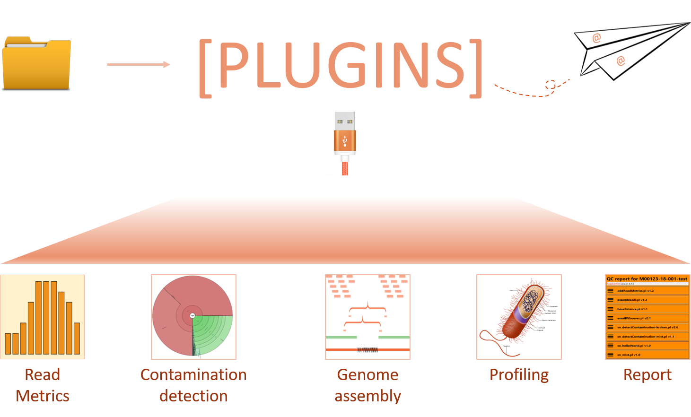

# SneakerNet

## Synopsis

A pipeline for processing reads from a sequencing run. Currently supports Illumina or Ion Torrent,
but it can be expanded to other platforms.

    # Run SneakerNet on the example data
    SneakerNetPlugins.pl --numcpus 4 t/data/M00123-18-001

  

## Installation

See [docs/INSTALL.md](docs/INSTALL.md)

## Workflow

_NOTE_: to ensure all dependencies are met, please follow
the dependencies section under the [installation document](docs/INSTALL.md).

### Creating a SneakerNet project directory

_For more information on a SneakerNet-style folder, see [docs/SneakerNetInput.md](docs/SneakerNetInput.md)_

SneakerNet requires a project directory that is in a certain format already.
To create the project, you can use `SneakerNet.ro.pl`.  For example,

    SneakerNet.ro.pl --createsamplesheet -o M1234-18-001-test miseq/working/directory

M01234-19-01-test is a project folder name, where it is dash-delimited and contains
machine name, year, ordinal, and optionally a name.

### Running SneakerNet

It is generally a good idea to edit a file `snok.txt` to configure the run further.
For more information on the workflow, see the configuration section in `INSTALL.md`.
For example,

    echo "emails = example@example.com, blah@example.com" > t/data/M00123-18-001/snok.txt
    echo "workflow = default" >> t/data/M00123-18-001/snok.txt

And then run SneakerNet like so (optionally following the log with `tail -f`):

    SneakerNetPlugins.pl --numcpus 8 t/data/M00123-18-001 > t/data/M00123-18-001/SneakerNet.log 2>&1 &
    tail -f t/data/M00123-18-001/SneakerNet.log

## Output

SneakerNet produces a subfolder `SneakerNet` in your run directory.
It also emails a report. To view a sample report, please go to 
t/report.html
in this repository.

## Plugins

SneakerNet is based on plugins.  In this context, a plugin is an independent script
that can run an analysis on a run directory, accept standard inputs (e.g., `--help`),
and create standard output files.

For more details, see the [plugins readme](docs/PLUGINS.md).

### Plugins for developers

You too can develop for SneakerNet!  For more information, 
please look at the [readme for plugins](docs/PLUGINSDEV.md)
and the [contributing](CONTRIBUTING.md) doc.

