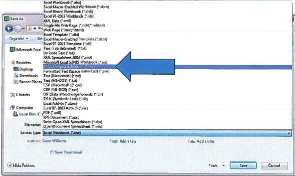
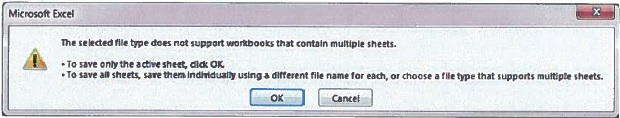
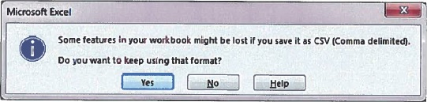
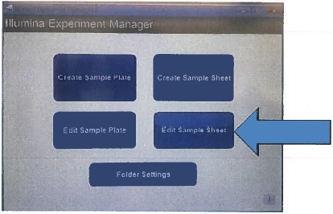

# The Rover spreadsheet

Rover is a spreadsheet that can explore your reads and return basic information
for you. This is a double meaning between the NASA planatary vehicles and a dog
that might fetch for you! This example will not show you how to perform a 
sequencing run because the wet lab is outside of the scope of this project.
However, this example will show you how to fill in the appropriate sample
spreadsheet for the MiSeq, which SneakerNet will also read.

# How to use the Rover spreadsheet

There are two rover spreadsheet examples in this directory, and they differ
only on the number of samples.

* Rover_NexteraXTv2_16samples.xlsx
* Rover_NexteraXTv2_48samples.xlsx

Thank you to the National Enteric Reference Laboratory (NERL) for the basis of
this documentation and spreadsheets.

1. Ensure that the full header (i.e., "Run Name", "Sample Plate Name", "Sample 
Sheet Name", "Library Prep Date", and "Technician" fields) and 
sample-related fields for each sample (i.e., "Sample Name", "Organism", "Index
1", "Index 2", and "Genome Size Estimate") are filled in on the "Initial
Dilution" tab.

2. Optional: If raw read files are to be automatically transferred from the storage space to another location (e.g., Calculation Engine of BioNumerics), then enter "Yes" in the appropriate column for each sample to transfer on the "Raw Read Routing" tab.

3. Navigate to the "SampleSheet" tab of the Library Prep Workbook, and "Save
As..." a "CSV (Comma delimited) (*.csv)" file on a USB portable hard drive. 
  * Note: Because the workbook contains several tabs, a message might pop up along
the lines of "The selected file type does not support workbooks that contain 
multiple sheets..." Click OK to save only the SampleSheet tab.  

  * Excel will continue to ask you the OK/Cancel question about there being multiple sheets 
until you click Cancel. The file is saved where you specify when you click OK 
the first time, so hit Cancel when prompted the second time.  

  * Then, because the SampleSheet tab contains formulas, a second warning will pop up
  "Some features in your workbook might be lost... Do you want to keep using
  that format?" Click No, and the file will be auto-saved to your selected
  drive. (See warning above about second OK/Cancel prompt)  

4. On the MiSeq, open the Illumina Experiment Manager, and choose "Edit Sample Sheet"  

5. Navigate to your sample sheet csv file, and make sure all relevant fields are filled in, including the "Use Adapter Trimming" checkbox on the right side of the screen, and all indices used are present and compatible.

